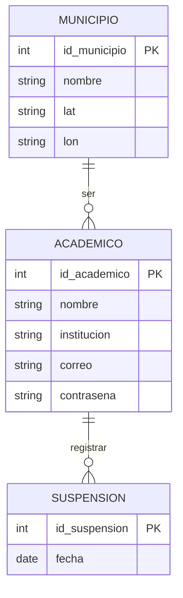
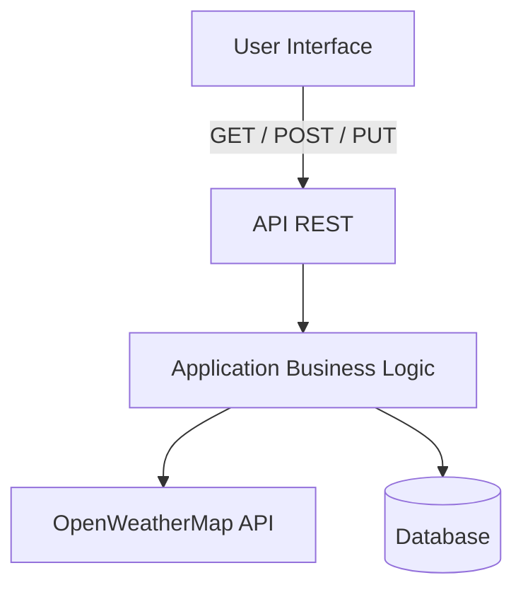

# SafeClass-API

## Indice
- [Descripción](#descripcion)
- [Integrantes](#integrantes)
- [Tecnologías](#tecnologias)
    - [Servicios externos](#servicios-externos)
- [Diseño de base de datos](#diseño-de-base-de-datos)
- [Arquitectura seleccionada](#arquitectura-seleccionada)
- [Plan de trabajo](#plan-de-trabajo)

## Descripcion

SchoolAlert es una API que ayuda a directivos y académicos a decidir si se deben suspender o continuar las actividades escolares en función de las condiciones climáticas.

El sistema consume datos de una API meteorológica externa y, a partir de factores como la probabilidad de lluvia, intensidad del viento y condiciones adversas, genera una recomendación automatizada.

Los usuarios pueden registrarse con los datos de su institución y ubicación, consultar el clima actual y pronósticos de hasta 5 días, así como registrar suspensiones para llevar un historial de decisiones.

La API está diseñada para centralizar la información climática y facilitar la toma de decisiones escolares de forma rápida y basada en datos.

## Integrantes

| Nombre  | Rol  | Correo Electronico  |
| :---- | :---- | :---- |
| Erick Daniel Martinez Martinez | Techlead Desarrollador Backend | zS23021810@estudiantes.uv.mx |
| Martinez Dominguez Elias | Control de Calidad Documentación | zs23017372@estudiantes.uv.mx |
| Sarricolea Cortés Ethan Yahel | Desarrollador Backend Documentación | zs23017351@estudiantes.uv.mx |

## Tecnologias

Las tecnologías utilizadas para el proyecto sob las siguientes:

- [Git](https://git-scm.com/)
- [Python](https://www.python.org/)
- [FastAPI](https://fastapi.tiangolo.com/)
- [MySQL](https://www.mysql.com/)
- [Postman](https://www.postman.com/)

### Servicios externos

Se utilizo la API [OpenWeatherMap](https://openweathermap.org) para la obtención de datos climaticos utilizados para las predicciones del sistema.

## Diseño de base de datos

Se realizo un diseño de una base de datos simple que permita almacenar las cuentas academicas, municipios de ubicación y el historial de suspensiones.

## Arquitectura seleccionada

Al tratarse de una API Rest se opto por una topología API Layer de la arquitectura SOA (Service Oriented Architecture)

## Plan de trabajo

> Aun en desarrollo