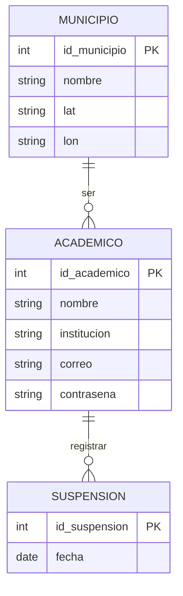
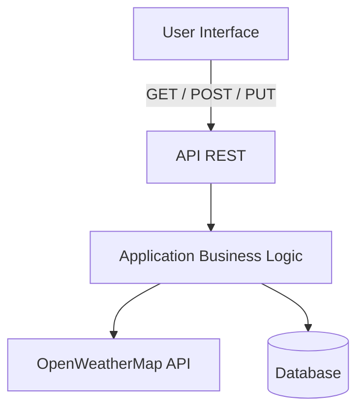
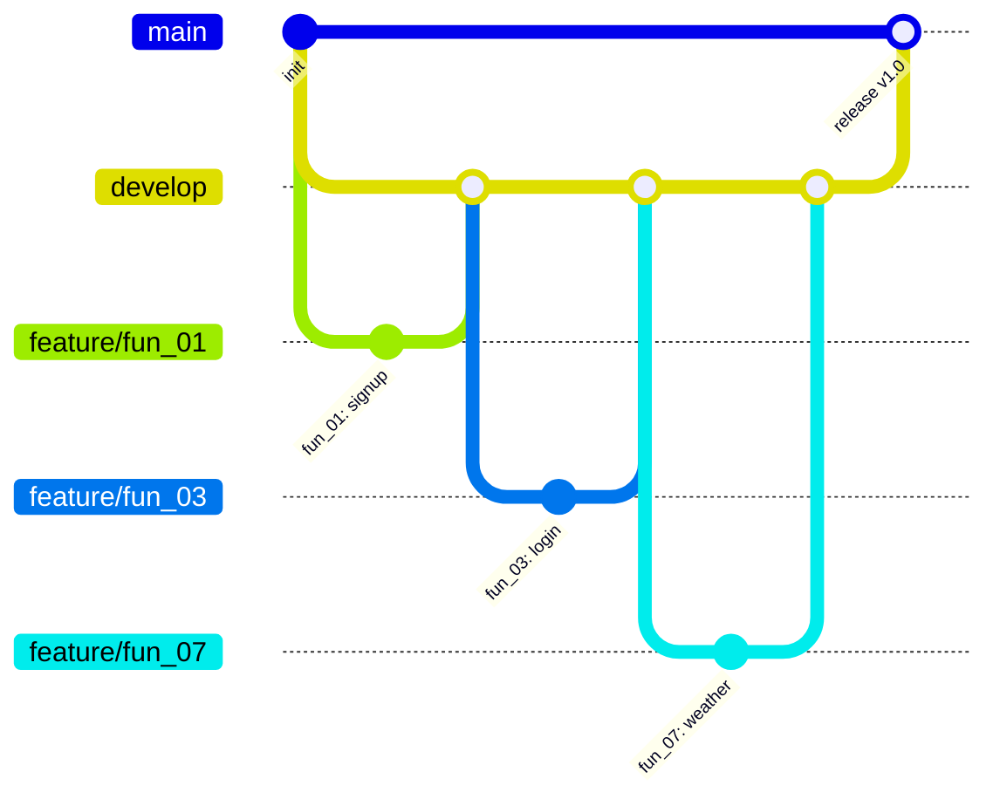

# SafeClass-API

## Indice

- [Descripción](#descripcion)
- [Integrantes](#integrantes)
- [Tecnologías](#tecnologias)
  - [Servicios externos](#servicios-externos)
- [Diseño de base de datos](#diseño-de-base-de-datos)
- [Arquitectura seleccionada](#arquitectura-seleccionada)
- [Estructura del proyecto](#estructura-del-proyecto)
- [Manual de uso](#manual-de-uso)
- [Estrategia de ramas](#estrategia-de-ramas)
- [Plan de trabajo](#plan-de-trabajo)

## Descripcion

SchoolAlert es una API que ayuda a directivos y académicos a decidir si se deben suspender o continuar las actividades escolares en función de las condiciones climáticas.

El sistema consume datos de una API meteorológica externa y, a partir de factores como la probabilidad de lluvia, intensidad del viento y condiciones adversas, genera una recomendación automatizada.

Los usuarios pueden registrarse con los datos de su institución y ubicación, consultar el clima actual y pronósticos de hasta 5 días, así como registrar suspensiones para llevar un historial de decisiones.

La API está diseñada para centralizar la información climática y facilitar la toma de decisiones escolares de forma rápida y basada en datos.

## Integrantes

| Nombre                         | Rol                                 | Correo Electronico           |
| :----------------------------- | :---------------------------------- | :--------------------------- |
| Erick Daniel Martinez Martinez | Techlead Desarrollador Backend      | zS23021810@estudiantes.uv.mx |
| Martinez Dominguez Elias       | Control de Calidad Documentación    | zs23017372@estudiantes.uv.mx |
| Sarricolea Cortés Ethan Yahel  | Desarrollador Backend Documentación | zs23017351@estudiantes.uv.mx |

## Tecnologias

Las tecnologías utilizadas para el proyecto sob las siguientes:

- [Git](https://git-scm.com/)
- [Python](https://www.python.org/)
- [FastAPI](https://fastapi.tiangolo.com/)
- [MySQL](https://www.mysql.com/)
- [Postman](https://www.postman.com/)

### Servicios externos

Se utilizo la API [OpenWeatherMap](https://openweathermap.org) para la obtención de datos climaticos utilizados para las predicciones del sistema.

## Diseño de base de datos

Se realizo un diseño de una base de datos simple que permita almacenar las cuentas academicas, municipios de ubicación y el historial de suspensiones.



## Arquitectura seleccionada

Al tratarse de una API Rest se opto por una topología API Layer de la arquitectura SOA (Service Oriented Architecture)



## Estructura del proyecto

El proyecto sigue una estructura de directorios modular:

```text
SafeClass-API/
├── config/
│   ├── db_connection.py   # Conexión a la base de datos
│   └── settings.py        # Configuración de la aplicación
├── controllers/
│   ├── auth_controller.py   # Controlador de autenticación
│   ├── municipality_controller.py # Controlador de municipios
│   └── suspension_controller.py # Controlador de suspensiones
├── middlewares/
│   ├── jwt_middleware.py    # Middleware de JWT
│   └── rate_limit_middleware.py # Middleware de limitación de tasa
├── models/
│   ├── database.py          # Modelo de base de datos
│   ├── municipality.py      # Modelo de municipio
│   └── suspension.py        # Modelo de suspensión
├── routes/
│   ├── auth_routes.py       # Rutas de autenticación
│   ├── municipality_routes.py # Rutas de municipios
│   └── suspension_routes.py # Rutas de suspensiones
├── services/
│   ├── openweathermap_service.py # Servicio de OpenWeatherMap
│   └── token_service.py         # Servicio de tokens
├── utils/
│   ├── weather_utils.py         # Utilidades de clima
│   ├── password_utils.py        # Utilidades de contraseña
│   └── token_utils.py           # Utilidades de tokens
├── main.py                      # Punto de entrada de la API
└── README.md
```

## Manual de uso

```bash
# Crear entorno virtual
python -m venv venv

# Activar entorno virtual
venv\Scripts\activate

# Instalar dependencias
uv pip install -r requirements.txt
```

### Ejecución

```bash
cd SafeClass-API
python -m venv venv
venv\Scripts\activate
uvicorn main:app --reload
```

## Estrategia de ramas

El proyecto utiliza una estrategia de ramas basada en **Git Flow simplificado**, con tres niveles:

| Rama             | Propósito                                                                                                                    |
| :--------------- | :--------------------------------------------------------------------------------------------------------------------------- |
| `main`           | Rama de producción / despliegue. Solo recibe merges desde `develop` cuando el código está estable y probado.                 |
| `develop`        | Rama de integración. Todas las ramas de funcionalidad hacen merge aquí antes de llegar a `main`.                             |
| `feature/fun_##` | Una rama por cada funcionalidad listada en el plan de trabajo. Se crean desde `develop` y se fusionan de vuelta a `develop`. |



### Flujo de trabajo

```bash
# 1. Crear rama de funcionalidad desde develop
git checkout develop
git pull origin develop
git checkout -b feature/fun_01

# 2. Trabajar y hacer commits
git add .
git commit -m "fun_01: implementar endpoint POST /auth/signup"

# 3. Hacer merge hacia develop (via Pull Request en GitHub)
git push origin feature/fun_01

# 4. Cuando develop está estable, merge a main para despliegue
# (solo el Techlead hace merge a main)
```

## Ejecución de pruebas

```bash
# Para ejecutar todas las pruebas
pytest

# Para ejecutar pruebas de un módulo específico
pytest tests/test_module.py

# Para ejecutar pruebas con cobertura
pytest --cov=your_package

# Para ejecutar pruebas con reporte HTML
pytest --cov=your_package --cov-report html
```

---

## Plan de trabajo

Listado de funcionalidades a implementar. Cada `fun_##` corresponde a una rama `feature/fun_##`.

|   ID   | Archivo(s) a modificar                                                                                | Función / Tarea                                                               |   Responsable    |   Fecha    |
| :----: | :---------------------------------------------------------------------------------------------------- | :---------------------------------------------------------------------------- | :--------------: | :--------: |
| fun_01 | `routes/auth_routes.py` · `controllers/auth_controller.py` · `models/database.py`                     | Endpoint **POST /auth/signup** — Registro de académico                        |   Erick Daniel   | 29/04/2026 |
| fun_02 | `controllers/auth_controller.py` · `utils/password_utils.py`                                          | Validación de correo duplicado y hash de contraseña en signup                 |   Erick Daniel   | 29/04/2026 |
| fun_03 | `routes/auth_routes.py` · `controllers/auth_controller.py` · `services/token_service.py`              | Endpoint **POST /auth/login** — Autenticación y generación de JWT             |   Erick Daniel   | 01/05/2026 |
| fun_04 | `middlewares/jwt_middleware.py` · `utils/token_utils.py`                                              | Middleware de protección de rutas con JWT                                     |   Erick Daniel   | 01/05/2026 |
| fun_05 | `routes/municipality_routes.py` · `controllers/municipality_controller.py` · `models/municipality.py` | Endpoint **POST /municipios** — Listar todos los municipios                   |   Ethan Yahel    | 05/05/2026 |
| fun_06 | `routes/municipality_routes.py` · `controllers/municipality_controller.py`                            | Endpoint **GET /municipios/{id}** — Obtener municipio por ID                  |   Ethan Yahel    | 05/05/2026 |
| fun_07 | `routes/auth_routes.py` · `services/openweathermap_service.py` · `config/settings.py`                 | Endpoint **GET /weather** — Clima actual del municipio del usuario            |   Erick Daniel   | 09/05/2026 |
| fun_08 | `services/openweathermap_service.py` · `utils/weather_utils.py`                                       | Endpoint **GET /weather/{fecha}** — Pronóstico por fecha (máx. 5 días)        |  Elias Martínez  | 24/05/2026 |
| fun_09 | `routes/suspension_routes.py` · `controllers/suspension_controller.py` · `models/suspension.py`       | Endpoint **POST /suspensions** — Registrar suspensión                         |  Elias Martinez  | 07/05/2026 |
| fun_10 | `routes/suspension_routes.py` · `controllers/suspension_controller.py`                                | Endpoints **GET /suspensions** y **GET /suspensions/{fecha}**                 | Ethan Sarricolea | 07/05/2026 |
| fun_11 | `utils/weather_utils.py`                                                                              | Lógica de recomendación automática de suspensión según condiciones climáticas |                  |            |
| fun_12 | `middlewares/rate_limit_middleware.py`                                                                | Middleware de limitación de tasa (rate limiting)                              |                  |            |
| fun_13 | `config/db_connection.py` · `config/settings.py`                                                      | Configuración de conexión a MySQL con variables de entorno                    |   Erick Daniel   | 29/04/2026 |
| fun_14 | `tests/test_auth.py`                                                                                  | Pruebas unitarias de autenticación (fun_01 – fun_04)                          |  Elias Martinez  | 06/05/2026 |
| fun_15 | `tests/test_municipalities.py`                                                                        | Pruebas unitarias de municipios (fun_05 – fun_06)                             |  Elias Martinez  | 06/05/2026 |
| fun_16 | `tests/test_weather.py`                                                                               | Pruebas unitarias del servicio de clima (fun_07 – fun_08)                     |  Elias Martinez  | 06/05/2026 |
| fun_17 | `tests/test_suspensions.py`                                                                           | Pruebas unitarias de suspensiones (fun_09 – fun_10)                           |  Elias Martinez  | 06/05/2026 |
